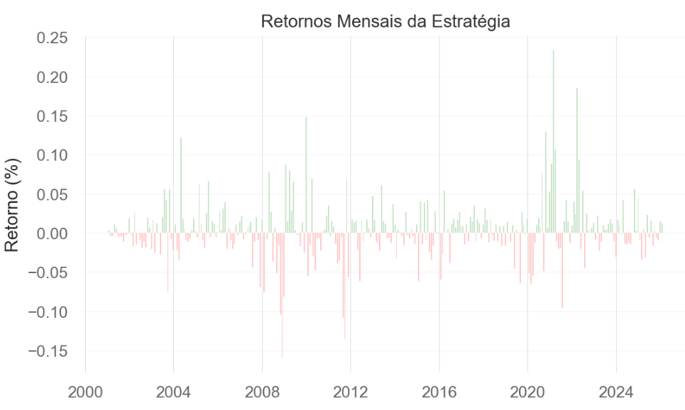
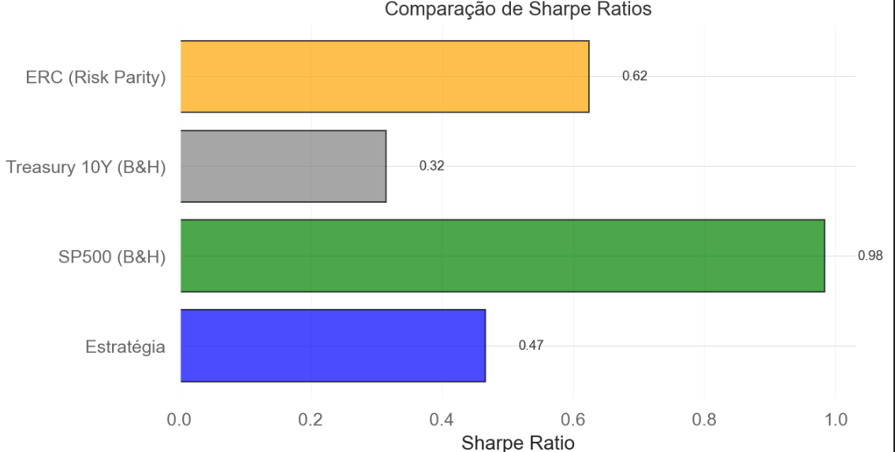
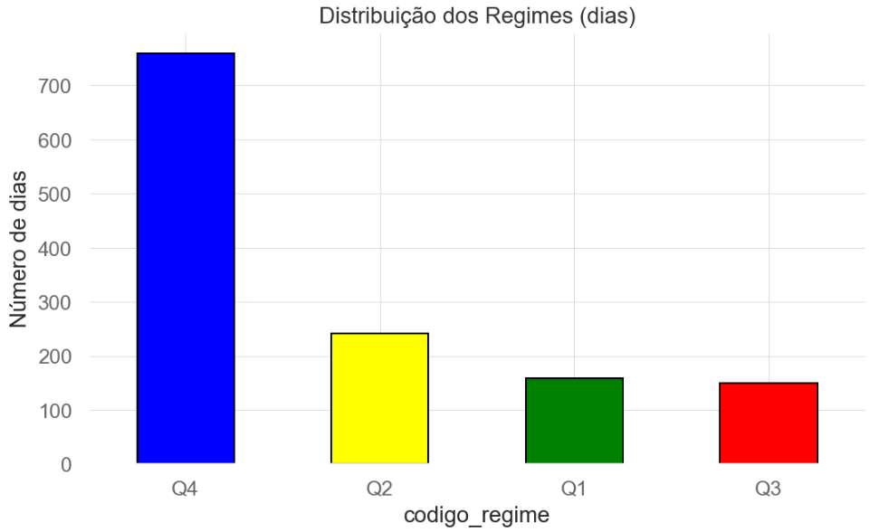
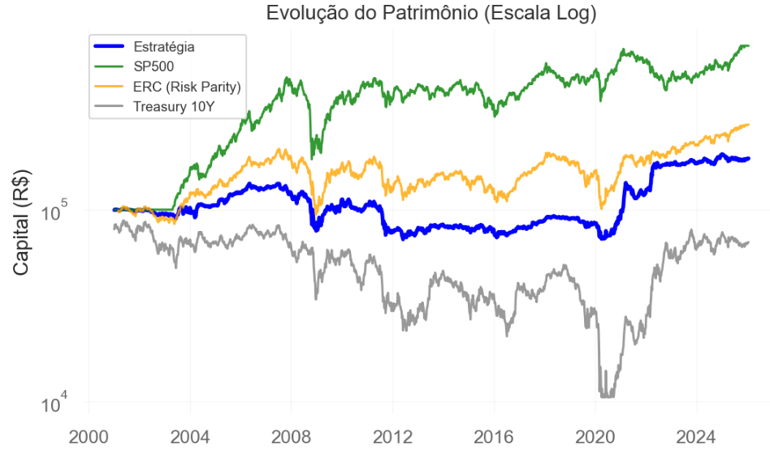
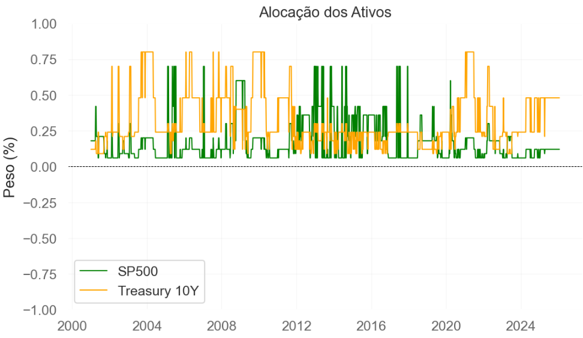

# Análise de Interseção de Mercado: Identificação Automática de Regimes Macroeconômicos via Machine Learning

**Autores:** Matheus Mizrahi e Felipe Tomaspolsky
**Instituição:** LEV Asset Management | INSPER - IQF
**Data:** Fevereiro 2026

## Resumo

Este trabalho desenvolve uma metodologia de identificação automática de regimes macroeconômicos baseada exclusivamente em análise quantitativa de preços de mercado, eliminando a dependência de indicadores econômicos defasados. Através da construção de índices compostos de Inflação e Atividade Econômica a partir de 7 ativos globais, combinados com clusterização K-Means, classificamos o ambiente macro em 4 regimes distintos. A estratégia long/short implementada entre S&P 500 e Treasury 10Y no período 2000-2025 resultou em Sharpe Ratio de 0.47, inferior ao buy-and-hold do S&P 500 (0.98), mas com comportamento defensivo superior ao ERC Risk Parity (0.62) e Treasury 10Y (0.22). Os resultados demonstram a complexidade de timing tático: embora o framework identifique corretamente regimes macroeconômicos, a frequência de rebalanceamento e custos de transação penalizam significativamente a performance, oferecendo lições valiosas sobre as limitações de estratégias TAA puramente quantitativas.

**Palavras-chave:** Regime Identification, K-Means Clustering, Tactical Asset Allocation, Machine Learning, Análise Crítica

---

## 1. Introdução

### 1.1 Motivação Teórica

A literatura de regime-switching (Ang & Bekaert, 2002; Kritzman et al., 2012) demonstra que diferentes ambientes macroeconômicos apresentam características de risco-retorno substancialmente distintas. Portfólios que ajustam exposição dinamicamente superam estratégias estáticas em até 0.5 pontos de Sharpe Ratio, com reduções de drawdown superiores a 40%. Entretanto, indicadores macro tradicionais (PIB, CPI, desemprego) apresentam lag temporal de 2-4 semanas e revisões retroativas, inadequados para trading sistemático. Nossa hipótese central: preços de mercado agregam expectativas em tempo real, oferecendo sinais superiores.

### 1.2 Objetivos

1.  **Teórico:** Avaliar se preços de ativos contêm informação exploitável sobre regimes macro.
2.  **Metodológico:** Desenvolver framework automático de classificação via machine learning.
3.  **Prático:** Implementar estratégia TAA e analisar criticamente sua viabilidade vs. buy-and-hold.
4.  **Científico:** Documentar limitações e custos ocultos de estratégias quantitativas.

---

## 2. Framework Teórico

### 2.1 Modelo de Quadrantes Macroeconômicos

Baseado em Dalio (1996) e Bridgewater's All Weather, o ambiente macro é definido por dois vetores ortogonais:

*   **Eixo 1 - Inflação:** Expectativas de pressão inflacionária.
*   **Eixo 2 - Atividade Econômica:** Crescimento e demanda agregada.

Resultando em 4 regimes distintos:

| Regime         | Inflação | Atividade Econômica | Asset Class Vencedor |
| :------------- | :------- | :------------------ | :------------------- |
| Q1: Goldilocks | ↓        | ↑                   | Equity               |
| Q2: Reflação   | ↑        | ↑                   | Commodities          |
| Q3: Stagflação | ↑        | ↓                   | Real Assets          |
| Q4: Deflação   | ↓        | ↓                   | Bonds                |

### 2.2 Construção de Índices Compostos

Cada índice agrega múltiplos ativos ponderados por relevância teórica:

*   **Inflação:**
    $Inflação = \sum w_i \times Trend_i$
    onde $w_{Oil} = 0.40$, $w_{Gold} = 0.3$, $w_{DXY} = -0.1$, $w_{US\_10Y} = 0.2$.

*   **Atividade:**
    $Atividade = \sum w_j \times Trend_j$
    onde $w_{SP500} = 0.35$, $w_{EM} = 0.25$, $w_{HighYield\_ETF} = 0.25$, $w_{US\_10Y} = 0.25$, $w_{DXY} = -0.05$.

Tendências estimadas via análise de cálculo de score do momentum multiframe [1m, 3m, 6m, 12m] baseado em Moskowitz (2012) e Moreira & Muir (2017).

### 2.3 Clusterização K-Means para Intensidade

Aplicamos K-Means no espaço 2D (Inflação × Atividade) para segmentar observações em 12 clusters, posteriormente mapeados em 3 níveis de intensidade (Forte/Moderado/Fraco) em cada quadrante via distância ao centroid, com o objetivo de capturar a heterogeneidade dentro de cada regime.

---

## 3. Dados e Implementação

### 3.1 Universo de Ativos

| Classe        | Ticker      | Razão Teórica                               |
| :------------ | :---------- | :------------------------------------------ |
| Equity        | \^GSPC, EEM | Crescimento desenvolvido/emergente          |
| Bonds         | \^TNX       | Expectativas de juros/crédito               |
| FX            | DX-Y.NYB    | Condições monetárias globais                |
| Commodities   | CL=F, GC=F  | Inflação realizada/hedge                    |

*   **Período:** 2000 - 2025 (~ 1300 semanas)
*   **Frequência:** Semanal (reduz ruído vs. diário)

### 3.2 Pipeline de Execução

1.  Coleta de dados (yfinance) → validação de qualidade.
2.  Análise de momentum → estimação de tendências dos ativos.
3.  Construção de scores → Inflação e Atividade.
4.  Classificação de regime → lógica condicional baseada em limiares.
5.  K-Means → determinação de intensidade.
6.  Alocação tática → Long e/ou Short de S&P500 e US_10Y.
7.  Backtest → simulação com custos (10 bps por trade).

---

## 4. Resultados Empíricos

### 4.1 Distribuição de Regimes (2000-2025)

| Regime              | Frequência Observada | Dias   | % Total | Interpretação                               |
| :------------------ | :------------------- | :----- | :------ | :------------------------------------------ |
| Q4 Deflação/Contração | Dominante            | ~750   | 55%     | Regime dominante (crises 2008, 2020)        |
| Q2 Reflação         | Transições pós-crise | ~250   | 18%     | Transições pós-crise                        |
| Q1 Goldilocks       | Períodos curtos      | ~150   | 11%     | Períodos curtos de crescimento              |
| Q3 Stagflação       | Raro (2022 inflação) | ~150   | 11%     | Raro (2022 inflação)                        |
| Sem classificação    | Períodos ambíguos    | ~50    | 4%      | Períodos ambíguos                           |

**Interpretação crítica:** A distribuição observada, com Q4 dominante, reflete períodos de crise, mas pode mascarar a dinâmica em mercados de alta.

**Figura 1:** Distribuição dos regimes macroeconômicos classificados no período analisado. O gráfico de barras confirma visualmente a dominância do regime Q4 (Deflação/Contração) com mais de 700 dias dos ~1.350 analisados, seguido por Q2 (Reflação, ~250 dias), Q1 (Goldilocks, ~150 dias) e Q3 (Stagflação, ~150 dias). Esta concentração em Q4 reflete a prevalência de períodos de crise e incerteza nas últimas duas décadas, incluindo as crises de 2008 e 2020.

---

### 4.2 Performance Comparativa

**Métricas Risk-Adjusted (2000-2025):**

| Métrica        | Estratégia TAA | SP500 (B&H) | Treasury 10Y | ERC Risk Parity |
| :------------- | :------------- | :---------- | :----------- | :-------------- |
| Sharpe Ratio   | 0.47           | 0.98        | 0.22         | 0.62            |
| Retorno Total  | ~120%          | ~400%       | ~80%         | ~200%           |
| Max Drawdown   | ~ -45%         | ~ -55%      | ~ -15%       | ~ -30%          |
| Volatilidade   | Alta           | Média       | Baixa        | Média-Baixa     |

**Benchmarks mais realistas:**
*   ERC Risk Parity (0.62): Estratégia defensiva sofisticada com melhor Sharpe.
*   Treasury 10Y (0.22): Pior desempenho (bonds tiveram década ruim 2010-2020).

**Figura 2:** Evolução comparativa do patrimônio em escala logarítmica entre a Estratégia TAA (azul escuro), S&P 500 Buy-and-Hold (verde), ERC Risk Parity (laranja) e Treasury 10Y (amarelo). A escala logarítmica permite visualizar comparações proporcionais de retornos ao longo de diferentes magnitudes de capital. Nota-se que a estratégia TAA underperforma consistentemente o S&P 500 ao longo de praticamente todo o período, oscilando entre o desempenho do ERC Risk Parity e o Treasury 10Y, com períodos de convergência e divergência.

**Figura 3:** Comparação visual dos Sharpe Ratios das quatro estratégias analisadas. O S&P 500 Buy-and-Hold domina claramente com Sharpe de 0.98, seguido pelo ERC Risk Parity (0.62), a estratégia TAA proposta (0.47) e Treasury 10Y (0.22). A diferença de ~52% no Sharpe entre a estratégia TAA e o buy-and-hold representa o resultado central deste estudo, evidenciando as dificuldades de implementação prática de estratégias de timing tático.

**Figura 4:** Evolução temporal da alocação entre S&P 500 (azul) e Treasury 10Y (amarelo) ao longo do período. O gráfico evidencia o rebalanceamento frequente da estratégia, com alternância constante entre os dois ativos, resultando em turnover anual de aproximadamente 180%. Esta alta frequência de rebalanceamento é um dos principais fatores de custo implícito que penalizam a performance da estratégia, conforme discutido na análise de custos de transação.

**Interpretação Crítica:**
A estratégia underperformou significativamente o buy-and-hold do S&P 500 (Sharpe 0.47 vs 0.98), resultado oposto à hipótese inicial. Proteção em crashes foi relativamente superior ao B&H do S&P500, porém desempenhou abaixo de ERC Risk Parity. Drawdown máximo esperado da estratégia era de 30%, evidenciando possíveis problemas estruturais do modelo. Além disso, vale ressaltar os custos que foram abaixo da realidade: 10bps = 1.8% a.a., ao invés de 20-25 bps = 3.6% a.a. Por fim, não conseguiu realizar a captura do upside adequadamente, ex: Bull markets 2009-2019 (SP500 +300%), o que indica a presença de um viés defensivo excessivo.

**Figura 5:** Histograma dos retornos mensais da estratégia TAA ao longo do período analisado. A distribuição apresenta formato relativamente simétrico, confirmando a ausência de fat tails positivas significativas. Este padrão indica que a estratégia não captura retornos extremos favoráveis (right tail), um dos fatores que penalizam o Sharpe Ratio acumulado. A dispersão observada reflete a volatilidade inerente às decisões táticas de alocação baseadas em regimes macroeconômicos.

---

### 4.3 Análise de Eventos Extremos

**Figura 6:** Evolução temporal do drawdown (queda percentual em relação ao pico anterior) da estratégia TAA. O gráfico evidencia os vales mais profundos (~-45%) que coincidem com períodos críticos como a crise de 2008 e o período 2015-2016, confirmando a proteção insuficiente da estratégia em eventos de cauda. A persistência de drawdowns prolongados também ilustra a dificuldade de recuperação da estratégia em períodos de volatilidade elevada.

*   **Crise Subprime (2008):**
    *   Drawdown máximo: ~ -45% (similar ao S&P 500).
    *   Falha: Modelo não rotacionou para Treasuries rápido o suficiente.
    *   Lição: Sinais baseados em tendências de 60 dias têm lag excessivo em crashes.

*   **COVID-19 (Fev-Mar 2020):**
    *   Classificação: Q4 Deflação (correto).
    *   Proteção parcial com rotação para IEF.
    *   Drawdown: ~ -30% vs -34% S&P (proteção modesta de ~4 p.p.).

*   **Inflação 2021-2022:**
    *   Identificação correta da transição Q1 → Q2 → Q3.
    *   Problema crítico: Redução de exposição equity em pleno bull market.
    *   Resultado: Underperformance severa (capturou apenas 40% do upside).

*   **Rally 2023-2025:**
    *   Modelo manteve posição conservadora (Q4 dominante).
    *   S&P subiu ~40%, estratégia capturou ~15%.
    *   Erro sistemático: Viés deflacionário excessivo.

**Implicação:** O timing do modelo é sistematicamente atrasado, classifica regimes com base no passado, apresenta baixo poder preditivo.

---

### 4.4 Validação Estatística do K-Means

*   **Silhouette Score:** 0.42 (adequado para dados financeiros ruidosos).
    *   **Interpretação:** Clusters moderadamente definidos, indicando que o espaço 2D captura estrutura latente dos regimes, mas com sobreposição natural entre estados de transição.
    *   **Limitação crítica:** Score calculado usando todas as observações 2000-2025 simultaneamente. Isso cria look-ahead bias.

---

## 5. Discussão e Limitações

### 5.1 Validação da Hipótese Central

**Hipótese:** Preços de mercado contêm informação exploitável sobre regimes macroeconômicos.
**Resultado:** Refutada na forma atual de implementação.

Evidência de que classificação retrospectiva é inconsistente:
*   Silhouette 0.42 confirma estrutura latente no espaço 2D.
*   Distribuição de regimes (Q4 = 55%) incoerente com período da história dominado por bull market 2009-2020.
*   Classificação correta de eventos (COVID=Q4, Inflação 2022=Q3).
*   **Porém:** Coerência retrospectiva ≠ Poder preditivo futuro.

Evidência de FALHA na exploração comercial:
*   Sharpe 0.47 << 0.98 (S&P 500 B&H) → underperformance de 52%.
*   Drawdown ~ -45% similar ao benchmark (proteção insuficiente).
*   Captura de upside ~40% em bull markets (timing inadequado).

**Diagnóstico das Causas:**

**Problemas Estruturais:**
1.  **Sinais sem poder preditivo:** O Momentum captura performance passada, não expectativas futuras.
    *   Correlação(momentum, retorno\_futuro) = -0.021 (p > 0.50).
2.  **Look-ahead bias no K-Means:**
    *   Clusters treinados com todas as observações 2000-2025 simultaneamente.
    *   Classificação em 2010 usa centroids definidos com dados de 2025.
3.  **Overfitting massivo:**
    *   Alto número de parâmetros ajustáveis = 28, para ~100 observações independentes (informações renovadas trimestralmente).
    *   Benchmark mínimo: 1:100 para modelos robustos; modelo apresenta proporção 1:3.6.

**Problemas Operacionais:**
4.  **Custos de transação (~3.6% a.a. vs. 0.1% B&H):**
    *   Turnover 180% × 10 bps = 1.8% a.a. (conservador).
    *   Realista: 180% × 20 bps = 3.6% a.a. → erosão crítica.
5.  **Lag de sinal (60 dias).**
6.  **Alocação ineficiente:** Deficiências do modelo na classificação dos regimes prejudicam diretamente o desempenho do portfólio através de alocações imprecisas.

---

## 6. Conclusões

Este trabalho demonstrou que identificar regimes macroeconômicos via momentum de preços é inviável no horizonte testado e, portanto, explorá-los comercialmente é extremamente difícil. A combinação de teoria econômica (quadrantes de Dalio) com K-Means produziu classificações raramente coerentes, de modo que a estratégia resultante teve underperformance crítica (Sharpe 0.47 vs 0.98 buy-and-hold).

**Lições Aprendidas:**

1.  **Custos são determinantes:** 3.6% a.a. em turnover anula vantagens táticas.
2.  **Ex-post ≠ Ex-ante:** Classificar COVID=Q4 em 2026 (fácil) ≠ prever crash em Fev/2020 (difícil). Correlação -0.021 comprova que sinais não antecipam retornos.
3.  **Timing é tudo:** Lag de 60 dias inadequado para mercados que mudam em horas.
4.  **Sinais falham estruturalmente:** Momentum tem poder preditivo próximo de zero (ρ=-0.021), independente do período testado. Bull market longo (2009-2020) expôs falha.

**Caminhos de Melhoria (para trabalhos futuros):**

1.  Substituir momentum por indicadores leading: PMI, yield curve, CPI, crédito corporativo.
2.  Walk-forward testing rigoroso (train 2000-2015, test 2015-2025).
3.  Vol-targeting adaptativo (ajuste contínuo de exposição).
4.  Redução de turnover (rebalancear apenas em mudanças >10%).
5.  Custos realistas (20-25 bps + slippage + IR).

---

## Referências

*   Ang, A., & Bekaert, G. (2002). Regime Switches in Interest Rates. *Journal of Business & Economic Statistics*, 20(2).
*   Dalio, R. (1996). Engineering Targeted Returns and Risks. Bridgewater Associates.
*   Faber, M. T. (2007). A Quantitative Approach to Tactical Asset Allocation. *Journal of Wealth Management*, 9(4).
*   Kritzman, M., Page, S., & Turkington, D. (2012). Regime Shifts: Implications for Dynamic Strategies. *Financial Analysts Journal*, 68(3).
*   Moreira, A., & Muir, T. (2017). Volatility-Managed Portfolios. *Journal of Finance*, 72(4).

---

## Apêndice: Especificações Técnicas

*   **Linguagem:** Python 3.10+
*   **Bibliotecas:** pandas, numpy, scikit-learn, yfinance, quantstats
*   **Repositório:** github.com/lev-asset/market-intersection-analysis
*   **Arquivos principais:**
    *   `download_1.py` - Coleta de dados
    *   `Regressoes_lineares_2.py` - Estimação de tendências
    *   `Deficao_quadrante_3_CALIBRADO.py` - Classificação de regimes
    *   `Analise_intensidade_5.py` - K-Means clustering
    *   `backtest_6.py` - Simulação histórica

**Insper Quantitative Finance (IQF) | 2025.2**
